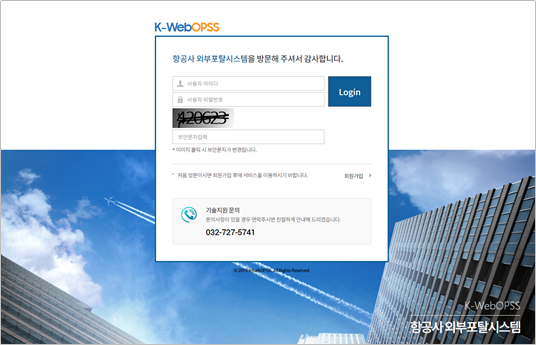

# 제 1 장 개요

## 1. K-WebOPSS 항공사 외부포탈시스템 개요

항공사의 운항증명 발급, 변경신청 등 온라인 업무처리를 위한 외부포탈시스템을 구축하여 운항당국과 항공사 간의 각종 정보공유와 업무처리를 효율적으로 하는 시스템을 제공한다.

## 2. K-WebOPSS 항공사 외부포탈시스템 접속

웹 브라우저를 이용하여 시스템에 접속한다. [https://wps.systemsafety.kr](http://wps.systemsafety.kr/)

